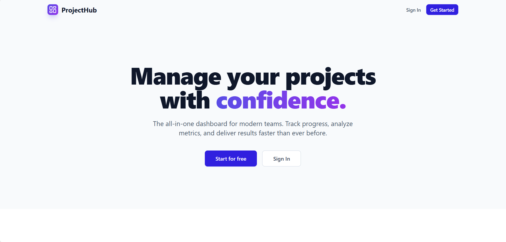
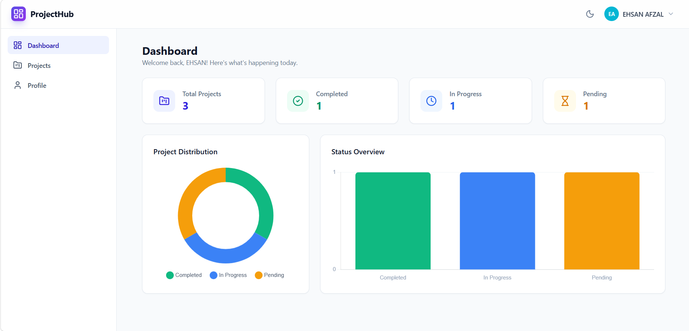
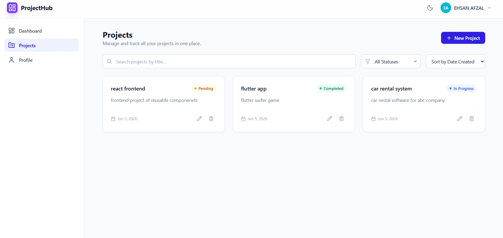

# ProjectHub - Full-Stack Project Management Dashboard

Hi there! Thanks for taking the time to review my submission. 

This is **ProjectHub**, a production-ready MERN stack application designed to help teams manage their projects seamlessly. I built this focusing on clean architecture, responsive UI, and robust backend security.

**Repository Link**: [github.com/EhsanAfzal005/fullstack-project-dashboard](https://github.com/EhsanAfzal005/fullstack-project-dashboard)

---

## Screenshots & Demo

### Landing Page


### Dashboard


### Projects Page


### Demo Video
[Watch the demo video (Direct Link)](https://github.com/EhsanAfzal005/fullstack-project-dashboard/raw/main/screenshots/demo.mp4)

---

## Easy Setup Guide

I've made sure getting this project up and running locally is as frictionless as possible. You'll just need Node.js (v18+ recommended) and a running MongoDB instance.

### 1. Clone the repository
```bash
git clone <your-repo-url>
cd FS-APP-DASH
```

### 2. Start the Backend
The backend runs on port `5000` and provides the API and database connection.

```bash
cd backend
npm install
```

Create a `.env` file in the `backend` folder with the following:
```env
NODE_ENV=development
PORT=5000
MONGO_URI=mongodb://localhost:27017/projecthub  # Or your MongoDB Atlas URI
JWT_SECRET=your_super_secret_jwt_key
JWT_EXPIRE=30d
CORS_ORIGIN=http://localhost:3000
```

Start the server:
```bash
npm run dev
```
*You should see a message saying "MongoDB Connected" and "Server running on port 5000".*

### 3. Start the Frontend
The frontend is powered by Vite and React, running on port `3000`.

Open a **new terminal tab/window**:
```bash
cd frontend
npm install
```

Start the Vite development server:
```bash
npm run dev
```

**That's it!** Navigate to `http://localhost:3000` in your browser to see the app in action.

---

## Assumptions & Limitations

To keep the scope of this project focused and deliverable within the timeframe, I made a few calculated assumptions and accepted some limitations:

### Assumptions
- **Authentication**: I assumed a standard email/password JWT-based authentication flow was preferred over OAuth (Google/GitHub) for this specific assignment to demonstrate core backend security knowledge.
- **Data Scope**: Currently, projects are scoped entirely to the individual user who created them. Shared workspaces or team collaboration (multi-user projects) were assumed to be out-of-scope for this iteration.
- **Environment**: I assumed the reviewer would have a local MongoDB instance running or be comfortable plugging in an Atlas URI.

### Limitations
- **Image Uploads**: Profile pictures currently rely on static URLs/initials. An AWS S3 integration or local Multer setup for image uploads was omitted to prioritize core CRUD and Analytics functionality.
- **Pagination**: While the backend fully supports pagination, filtering, and sorting, the frontend currently utilizes stable, traditional pagination instead of infinite scrolling.
- **Email Verification**: User registration creates the account instantly without an email verification step (OTP/Magic Link) to simplify the evaluation process.

---

## Tech Stack Highlights

**Frontend**
- **React & Vite**: For lightning-fast HMR and optimized builds.
- **Tailwind CSS v3**: For a highly responsive, modern, and customizable UI (including Dark Mode).
- **Chart.js**: For rendering beautiful, interactive analytics on the dashboard.

**Backend**
- **Node.js & Express**: Handling API routing and middleware logic.
- **MongoDB & Mongoose**: For flexible, schema-based data modeling.
- **Security**: Implemented `helmet`, `cors`, `express-rate-limit`, `mongo-sanitize`, and `hpp` to ensure the API is robust against common web vulnerabilities.

---
Thank you again for your time!
